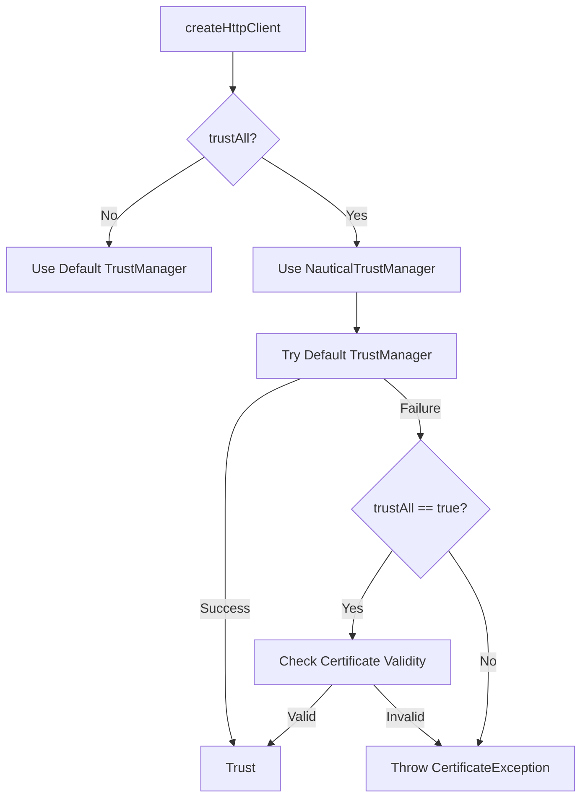

# Implementation Plan - Resolve SSL Warning in NauticalPlugin

The goal is to address the `CustomX509TrustManager` warning in `NauticalPlugin.kt` by providing a more robust and secure implementation for handling SSL certificates, specifically when the "Trust All" setting is enabled for Signal K servers.

## User Review Required

> [!IMPORTANT]
> The "Trust All" setting is inherently insecure. This plan maintains the functionality (as it's often necessary for local Signal K servers with self-signed certificates) but improves the implementation to be more robust and follows Android best practices for such cases.

## Proposed Changes

### Nautical Plugin

#### [MODIFY] [NauticalPlugin.kt](file:///home/administrator/AndroidStudioProjects/osmand-nautical/OsmAnd/src/net/osmand/plus/plugins/nautical/NauticalPlugin.kt)
- Refactor `createHttpClient` to use a more structured approach for SSL configuration.
- Introduce a dedicated (internal) `NauticalTrustManager` class that encapsulates the logic for delegating to the system trust manager and handling the "trust all" fallback.
- Use `@SuppressLint("CustomX509TrustManager")` on the new class with a clear explanation of why it is needed and what it does.
- Improve the `checkServerTrusted` logic to be more explicit about what is allowed when `trustAll` is true.
- Ensure `hostnameVerifier` is only relaxed if `trustAll` is truly enabled, and add comments about its insecurity.

## Verification Plan

### Automated Tests
- I will attempt to run the existing unit tests for the Nautical module if available.
- I'll check if there are any specific tests for `SignalKConnection`.

### Manual Verification
- Verify that the code compiles.
- Check that the warning is gone after applying the changes.
- (In a real device) Verify that connection to a Signal K server still works with "Trust All" enabled.
